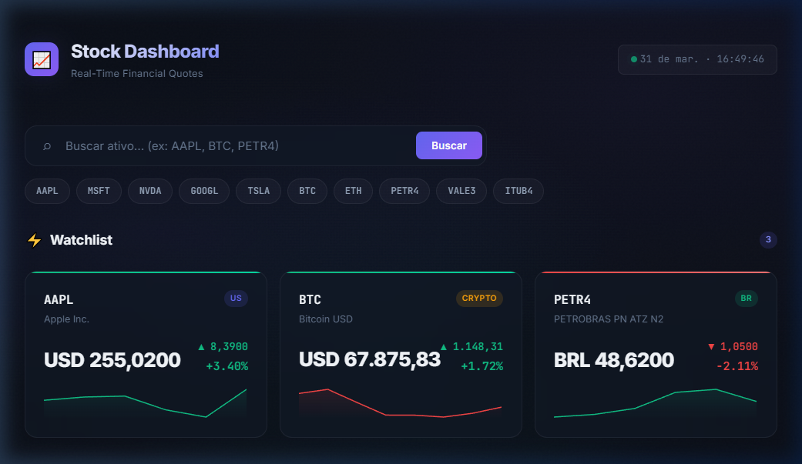
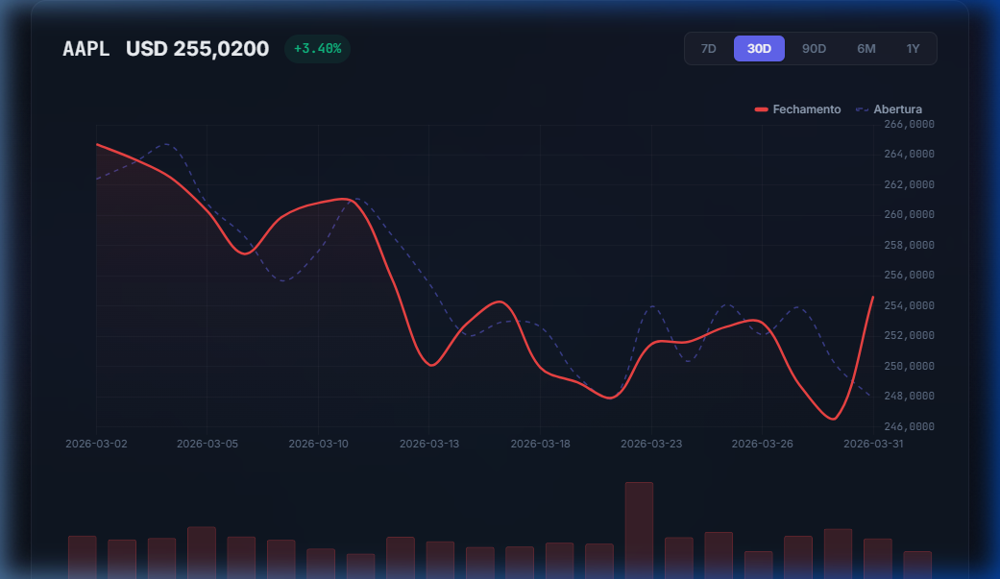

<div align="center">

# 📈 Stock Dashboard

**Dashboard de cotações financeiras em tempo real — no terminal e na web**

[](https://python.org)
[](https://flask.palletsprojects.com)
[](LICENSE)
[](https://finance.yahoo.com)
[](https://pytest.org)

Acompanhe ações e criptomoedas em tempo real direto do terminal ou do navegador. Visualize preços, gráficos históricos e salve dados localmente — sem precisar de API key.

</div>

---

## ✨ Funcionalidades

- 🔍 **Cotações em tempo real** — Busque preços de ações americanas (AAPL, MSFT), brasileiras (PETR4, VALE3) e criptomoedas (BTC, ETH)
- 📊 **Gráficos no terminal** — Histórico de 30 dias com gráficos ASCII usando plotext
- 🌐 **Dashboard web** — Interface moderna no navegador com Chart.js, dark mode e glassmorphism
- 📉 **Abertura vs Fechamento** — Compare preços de abertura e fechamento lado a lado
- 📦 **Análise de Volume** — Visualize tendências de volume de negociações
- 💾 **Armazenamento local** — Salva automaticamente o histórico em arquivos CSV
- 🎨 **CLI bonita** — Interface no terminal com cores, tabelas e painéis (Rich)
- ⚡ **Tratamento de erros** — Lida com tickers inválidos, falhas de API e falta de conexão

## 📸 Screenshots

### Dashboard Web — Watchlist com Preços em Tempo Real

<p align="center">
  
</p>

### Dashboard Web — Gráfico Interativo

<p align="center">
  
</p>

### CLI — Menu Interativo no Terminal

```
╔══════════════════════════════════════════════════╗
║        📈 STOCK DASHBOARD  v1.0.0               ║
║    Cotações em Tempo Real no Terminal            ║
╚══════════════════════════════════════════════════╝

╭────────────────────────────────────────────────────╮
│                  Menu Principal                     │
├──────────┬──────────────────────────────────────────┤
│  Opção   │ Descrição                                │
├──────────┼──────────────────────────────────────────┤
│    1     │ 🔍  Buscar cotação atual de um ativo      │
│    2     │ 📊  Ver histórico de preços (gráfico)     │
│    3     │ 📉  Ver gráfico Abertura vs Fechamento    │
│    4     │ 📦  Ver volume de negociações             │
│    5     │ 💾  Listar dados salvos localmente        │
│    6     │ 🗑️   Remover dados de um ativo            │
│    0     │ 🚪  Sair                                  │
╰────────────────────────────────────────────────────╯
```

## 🚀 Começando

### Pré-requisitos

- Python 3.10 ou superior
- pip (gerenciador de pacotes do Python)
- Conexão com a internet (para buscar cotações)

### Instalação

1. **Clone o repositório**

   ```bash
   git clone https://github.com/seu-usuario/stock-dashboard.git
   cd stock-dashboard
   ```

2. **Crie um ambiente virtual** (recomendado)

   ```bash
   python -m venv venv

   # Windows
   venv\Scripts\activate

   # macOS / Linux
   source venv/bin/activate
   ```

3. **Instale as dependências**
   ```bash
   pip install -r requirements.txt
   ```

### Como Usar

#### 🖥️ Dashboard no Terminal (CLI)

```bash
python -m stock_dashboard.main
```

#### 🌐 Dashboard Web (Navegador)

```bash
python web/app.py
# Acesse http://localhost:5000
```

#### Exemplos Rápidos

```
# Após iniciar o menu CLI, escolha a opção 1 e digite:
AAPL        # Ação da Apple (EUA)
PETR4       # Ação da Petrobras (Brasil)
BTC         # Bitcoin
ETH         # Ethereum

# Escolha a opção 2 para ver um gráfico de 30 dias
# Os dados são salvos automaticamente na pasta data/
```

## 🏗️ Estrutura do Projeto

```
stock-dashboard/
├── stock_dashboard/           # Pacote principal (CLI)
│   ├── __init__.py            # Metadados e versão do pacote
│   ├── main.py                # Menu interativo no terminal (Rich)
│   ├── fetcher.py             # Busca de cotações via yfinance
│   ├── chart.py               # Gráficos no terminal via plotext
│   └── storage.py             # Operações de leitura/escrita de CSV
├── web/                       # Dashboard web
│   ├── app.py                 # Servidor Flask + API REST
│   └── static/
│       ├── index.html         # Página principal
│       ├── css/
│       │   └── style.css      # Design system (dark mode, glassmorphism)
│       └── js/
│           └── app.js         # Lógica do frontend (Chart.js, watchlist)
├── tests/                     # Testes automatizados
│   ├── test_fetcher.py        # Testes do módulo fetcher (15 testes)
│   └── test_storage.py        # Testes do módulo storage (10 testes)
├── data/                      # Armazenamento local de CSV (ignorado no git)
│   └── .gitkeep
├── requirements.txt           # Dependências do Python
├── .gitignore                 # Regras de exclusão do Git
├── LICENSE                    # Licença MIT
└── README.md                  # Este arquivo
```

## 🌐 API REST (Dashboard Web)

O servidor Flask expõe os seguintes endpoints:

| Método   | Endpoint                        | Descrição                                       |
| -------- | ------------------------------- | ----------------------------------------------- |
| `GET`    | `/api/quote/<symbol>`           | Cotação atual de um ativo                       |
| `GET`    | `/api/history/<symbol>?days=30` | Histórico de preços (salva CSV automaticamente) |
| `GET`    | `/api/saved`                    | Lista arquivos CSV salvos localmente            |
| `DELETE` | `/api/saved/<symbol>`           | Remove dados salvos de um ativo                 |
| `GET`    | `/api/watchlist/suggestions`    | Sugestões de tickers populares                  |
| `POST`   | `/api/multi-quote`              | Busca de cotações em lote                       |

## 🧪 Executando os Testes

```bash
# Executar todos os testes
pytest

# Executar com saída detalhada
pytest -v

# Executar com relatório de cobertura
pytest --cov=stock_dashboard --cov-report=term-missing

# Executar um arquivo de teste específico
pytest tests/test_fetcher.py -v
```

## 🛠️ Stack Tecnológica

| Tecnologia                                         | Finalidade                        |
| -------------------------------------------------- | --------------------------------- |
| [Python 3.10+](https://python.org)                 | Linguagem principal               |
| [yfinance](https://github.com/ranaroussi/yfinance) | Wrapper da API do Yahoo Finance   |
| [Rich](https://github.com/Textualize/rich)         | Interface bonita no terminal      |
| [plotext](https://github.com/piccolomo/plotext)    | Gráficos no terminal              |
| [pandas](https://pandas.pydata.org)                | Manipulação de dados e CSV        |
| [Flask](https://flask.palletsprojects.com)         | Servidor web e API REST           |
| [Chart.js](https://www.chartjs.org)                | Gráficos interativos no navegador |
| [pytest](https://pytest.org)                       | Framework de testes               |

## 🔒 Segurança

- ✅ **Nenhuma chave de API necessária** — usa o yfinance (API pública do Yahoo Finance)
- ✅ **Sem dados sensíveis** — nenhum segredo ou credencial armazenado no código
- ✅ **Dados locais apenas** — os CSVs são salvos localmente e ignorados pelo Git
- ✅ **.gitignore robusto** — exclui venv, .env, _.pem, _.key, caches e logs

## 🤝 Contribuindo

Contribuições são bem-vindas! Sinta-se à vontade para:

1. Fazer fork do repositório
2. Criar uma branch para sua feature (`git checkout -b feature/minha-feature`)
3. Fazer commit das mudanças (`git commit -m 'Adiciona minha feature'`)
4. Fazer push para a branch (`git push origin feature/minha-feature`)
5. Abrir um Pull Request

## 📄 Licença

Este projeto está licenciado sob a Licença MIT — veja o arquivo [LICENSE](LICENSE) para detalhes.

---

<div align="center">

Feito com ❤️ e Python

⭐ Dê uma estrela se achou útil!

</div>
